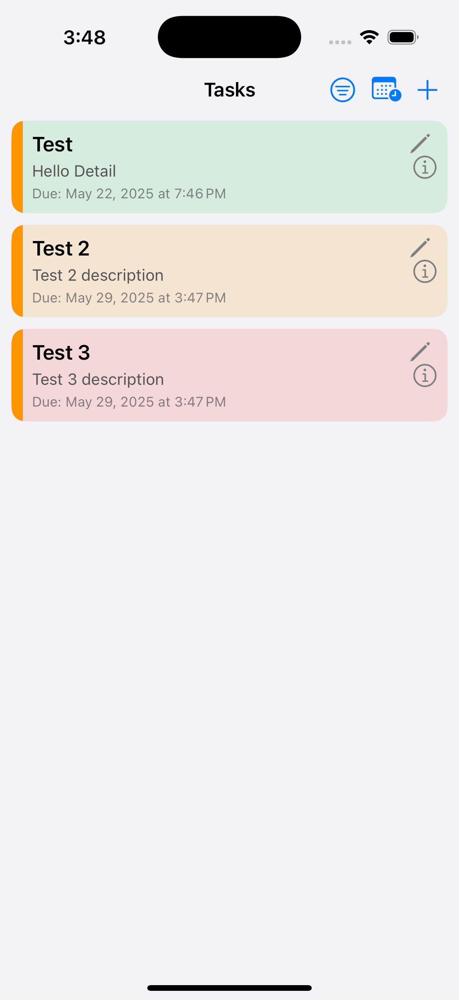
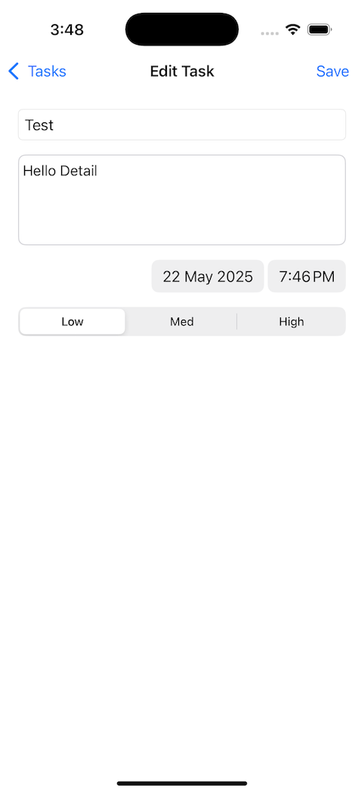
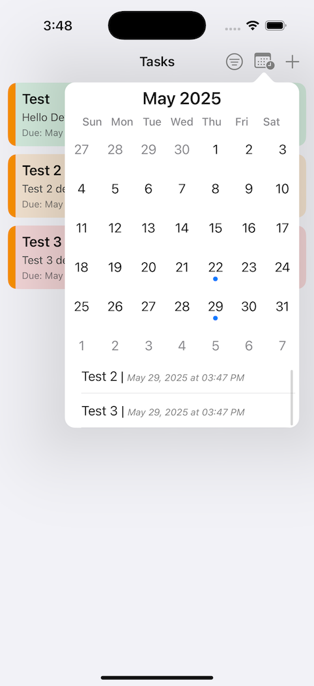

# TaskManager App

TaskManager is a productivity-focused iOS app designed to help users organize tasks with ease. It features an intuitive task list, task detail and edit screens, persistent local storage via Core Data, and a calendar view powered by JTAppleCalendar to visualize tasks by date.

---

## 📱 Features

- **Task List View**  
  View all tasks in a list, categorized and color-coded by task type or priority.

- **Task Detail & Edit**  
  Tap on any task to see full details, or edit existing tasks via the edit screen. You can also create new tasks easily.

- **Task Persistence**  
  All tasks are stored locally using Core Data. This ensures quick access and offline capabilities.

- **Color Coding**  
  Tasks are visually distinguished based on type or priority using custom color schemes.

- **Calendar Integration**  
  View tasks on a monthly calendar using the third-party `JTAppleCalendar` framework.  
  The calendar appears in a popover and highlights dates that have associated tasks.

---

## 🛠️ Technologies Used

- **Swift** – Primary development language.
- **UIKit** – User interface framework.
- **Core Data** – For local task data persistence.
- **JTAppleCalendar** – Open-source monthly calendar view.
- **MVC Architecture** – Used for organizing code cleanly.

---

## 📆 Calendar View

- Tap a calendar icon or use a gesture to open the calendar in a popover.
- The calendar highlights each date with tasks.
- Selecting a date filters the task list to show relevant tasks for that day.

---

## 💾 Data Model

Each task contains the following properties:
- `title`: String  
- `details`: String (optional)  
- `dueDate`: Date  
- `priority`: Int / Enum (used for color coding)  
- `taskType`: String (used for grouping or filtering)  
- `id`: UUID (used for uniquely identifying and managing tasks)

---

## 🧪 How to Use

1. Launch the app to see your existing tasks.
2. Tap on a task to view or edit it.
3. Tap the **+** button to create a new task.
4. Open the calendar popover to view tasks by date.

---

## 📸 Screenshots

### Task List Screen

### Task Detail Screen

### Edit/Create Task

### Calendar Popover

---

## 📚 Dependencies

- [JTAppleCalendar](https://github.com/patchthecode/JTAppleCalendar)

---

## 🔒 License

